# QuantumNumerovSolver
----------
An application in Python Numpy that uses the Numerov-Cooley Method to numerically solve the 1-D Time-independent Schrödinger Equation.

## Numerical Methods
----------
The Numerov Method is given by:
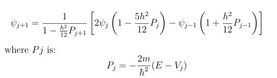

Cooley's Energy Correction Formula is:
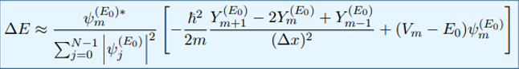

## Showcase
----------

### Particle In A Box
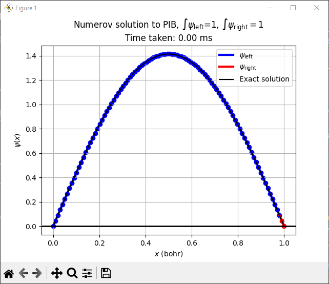
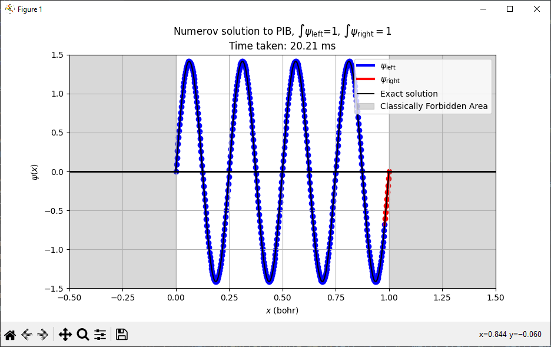

### Finite Potential Square Well
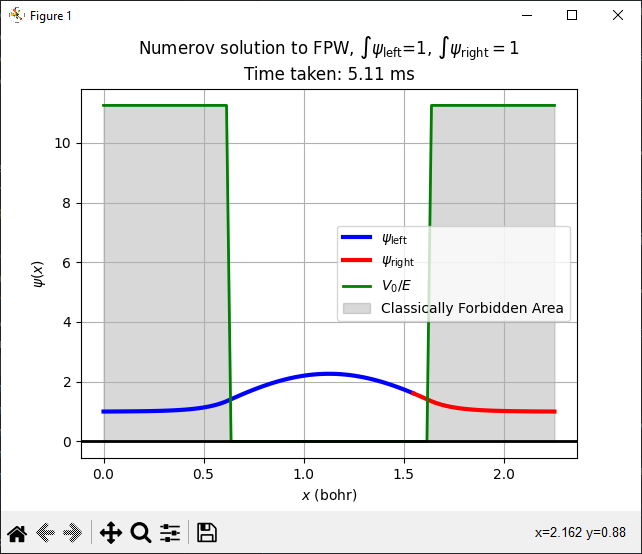
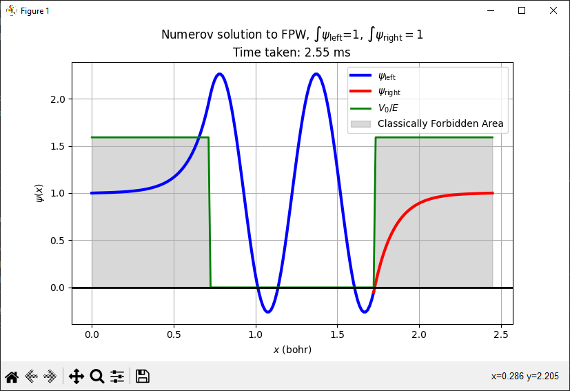

### The Quantum Harmonic Oscillator
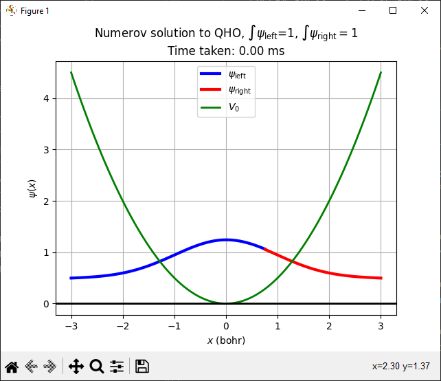
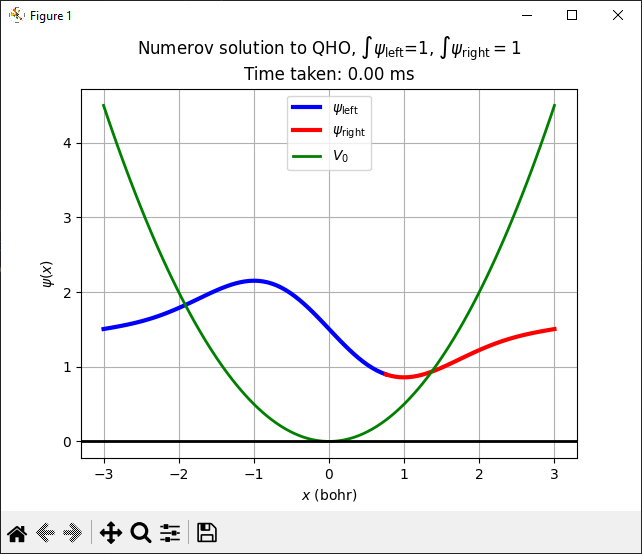
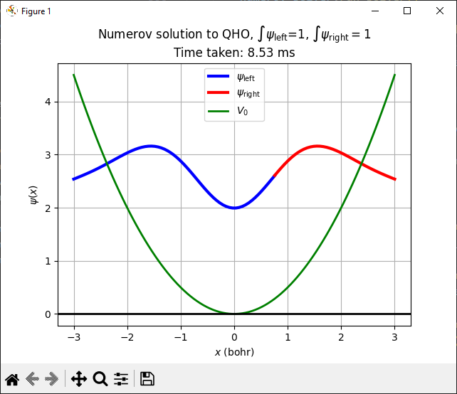
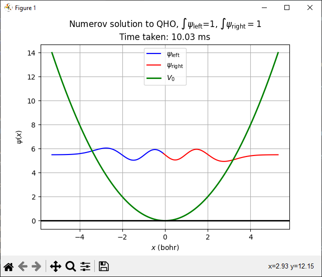

### Pöschl-Teller Potential
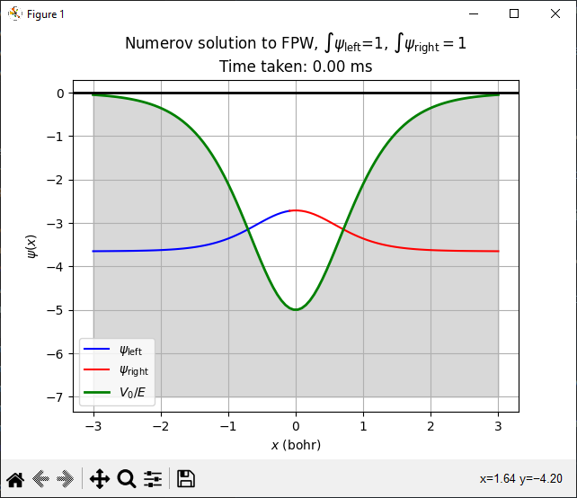
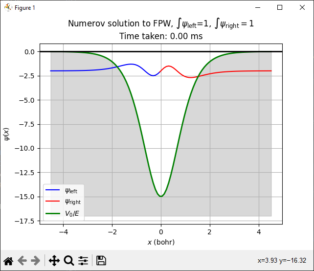

### Double Finite Potential Well
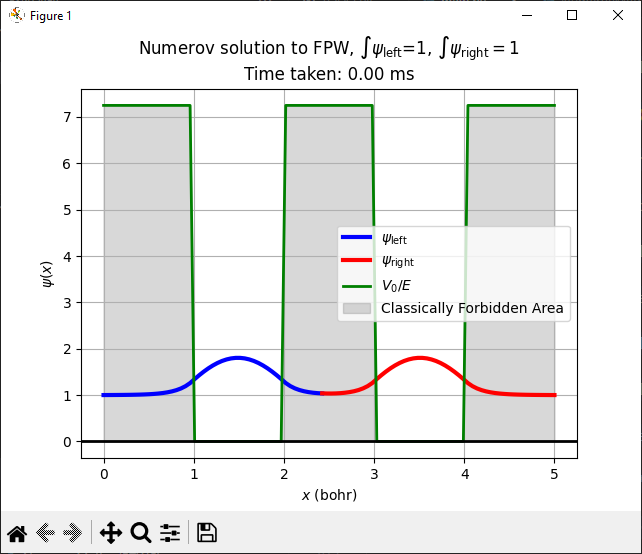
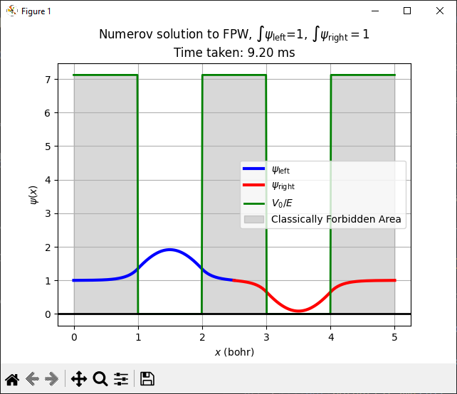
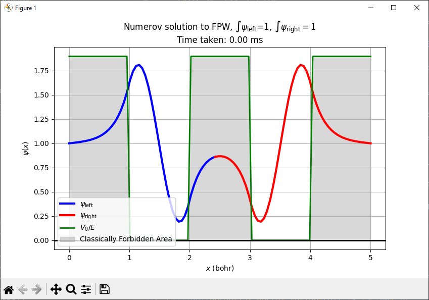
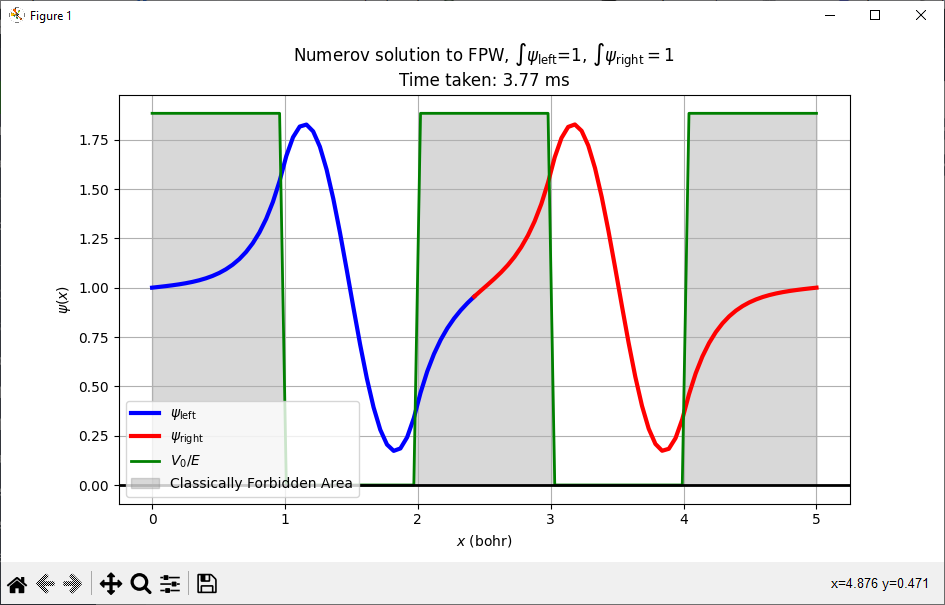
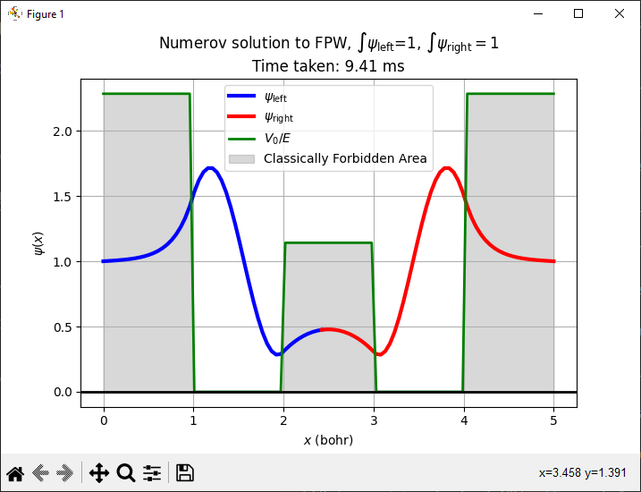
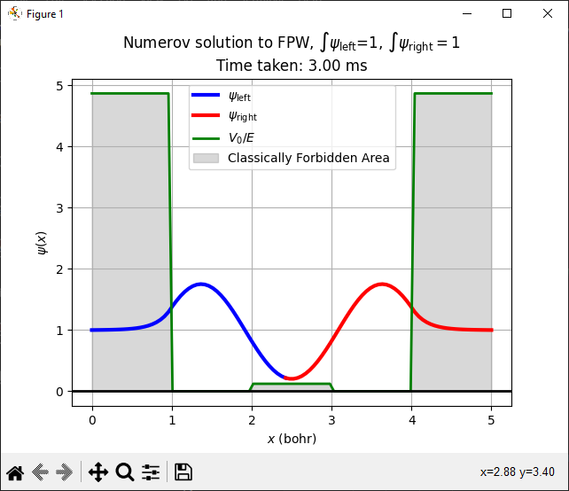

# How To:
----------
Save to a seperate folder and simply run main.py. 

## Requires
---------- 
Python 3, numpy, scipy, and matplotlib.

# Discussion
----------
I highly recommend that you read QuantumNumerovSolver.pdf. It gives a detailed rundown of the numerical methods used, as well as a brief overview of the python code, with some expected
results. 

This has been developed for University of Patras, Department of Electrical and Computer Engineering during the course of Introduction to Quantum Electronics, under Prof. Emmanuel Paspalakis.

My main goal in uploading this is to help out any other poor student that struggled as much as me to find some kind of implementation of these numerical methods in anything other than FORTRAN90. As a
result of this, the program and code developed is of dubious quality, with questionable results (details in the pdf) for anything other than undergraduate coursework. Still, it prints some nice wavefunctions
for the Particle In a Box Problem, for a Finite Potential Well, for the Quantum Harmonic Oscillator, a Pöschl-Teller Potential and a Double Finite Potential Well, all while using the Numerov Method, with 
matching, and Cooley's Energy Correction Formula for a given quantum state.

Special mention must go out to Joshua Izaac and Jingbo Wang with their book Computational Quantum Mechanics, which basically carried the entire numerical side of this work, as well as to the awesome interactive
lesson over at Liu Lab Computational Chemistry Tutorials (https://liu-group.github.io/interactive-Numerov-PIB/), which basically carried the python/numpy side of this work.
Many other sources went into this as well, which are mentioned at the pdf.
